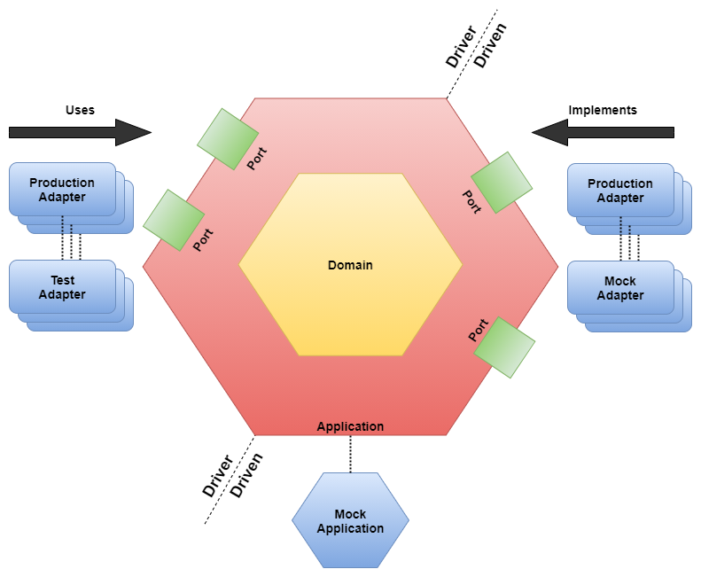
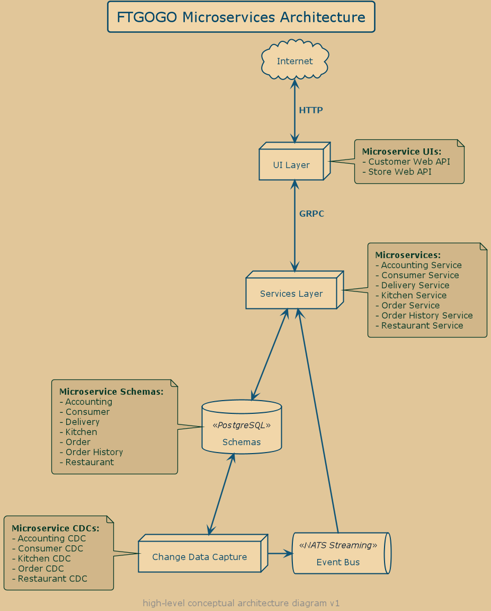
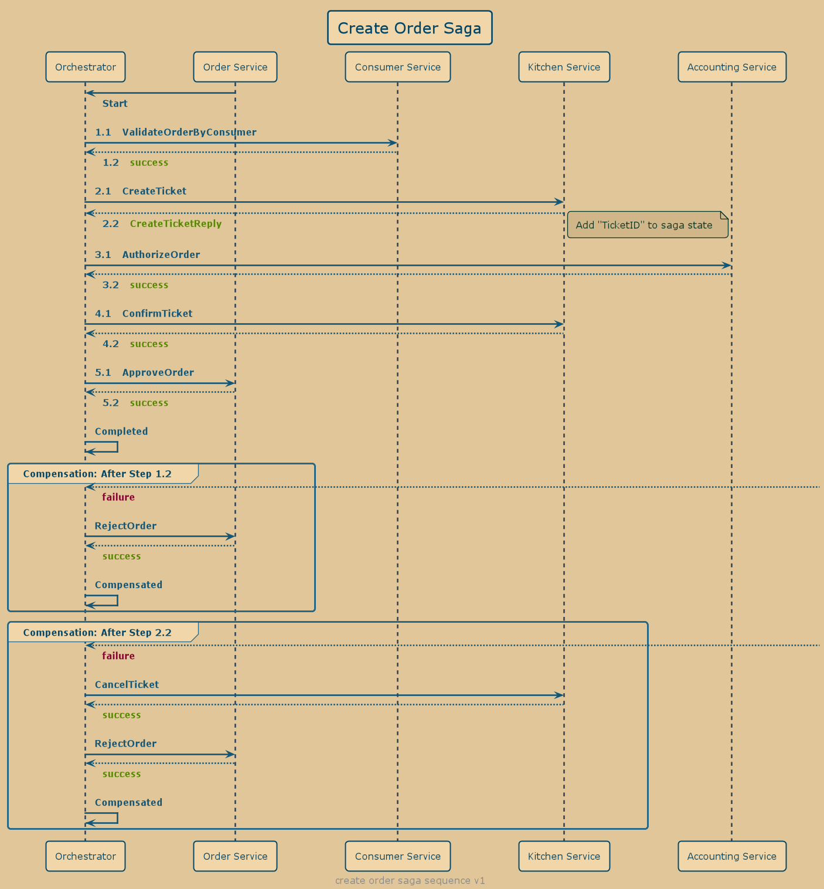
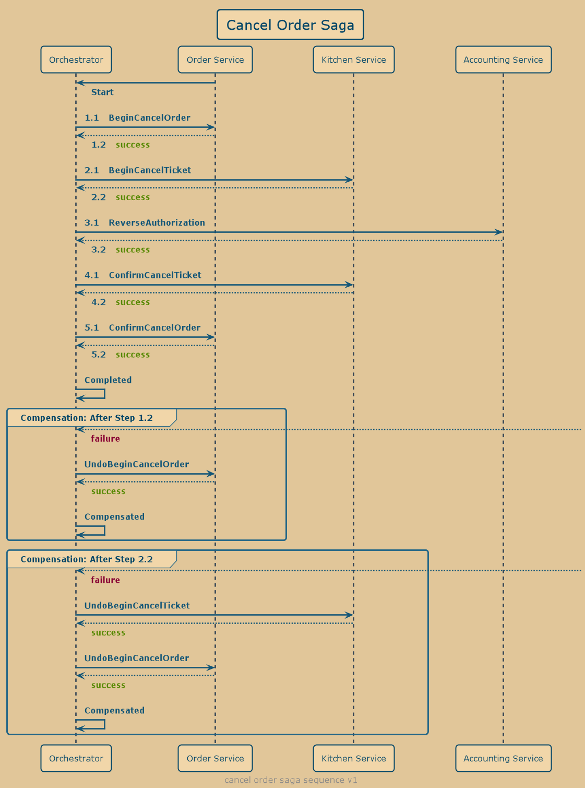
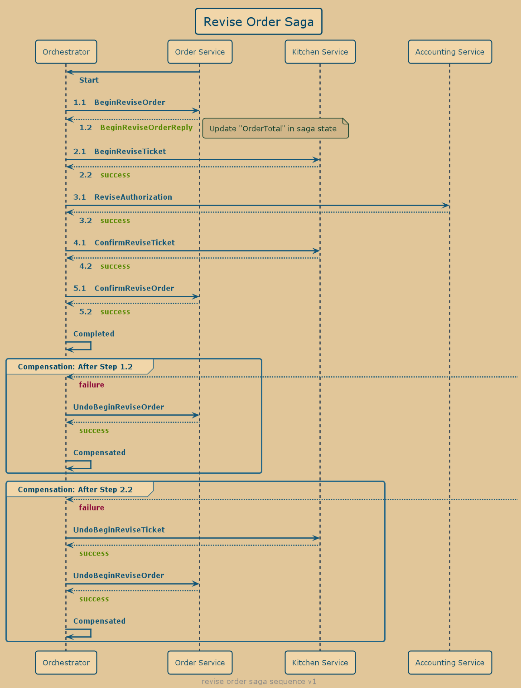

# ftgogo - event-driven architecture demonstration application

## Introduction

ftgogo (food-to-gogo) is a Golang implementation of
the [FTGO](https://github.com/microservices-patterns/ftgo-application) application described in the
book ["Microservice Patterns"](https://www.manning.com/books/microservices-patterns) by Chris Richardson. A
library [edat](https://github.com/stackus/edat) was developed to provide for Golang many of the solutions
that [Eventuate](https://eventuate.io/), the framework used by FTGO, provides for Java.

## Purpose

This repository exists to demonstrate the patterns and processes involved when constructing a distributed application
using [event-driven architecture](https://en.wikipedia.org/wiki/Event-driven_architecture).

This repository started as a Golang clone of the FTGO demonstration application but as time goes on it will grow to
demonstrate additional microservice patterns and techniques.

### What you'll find in this demonstration

1. [Architecture](#architecture)
    1. [Clean Architecture](#clean-architecture)
    1. [Code Layout](#code-layout)
    1. [Services](#services)
1. [Design](#design)
    1. [Event-Driven Architecture](#event-driven-architecture)
        1. [Outbox Pattern](#outbox-pattern)
        1. [Message Deduplication](#message-deduplication)
    1. [CQRS](#cqrs)
    1. [Event Sourcing](#event-sourcing)
    1. [Sagas](#sagas)
    1. [Backend-For-Frontend](#backend-for-frontend-bff)
    1. [GRPC and Protocol Buffers](#grpc-and-protocol-buffers)
    1. [Testing](#testing)
        1. [Specifications / Acceptance Tests](#specifications--acceptance-tests)
        1. [Integration Tests](#integration-tests)
        1. [Unit Tests](#unit-tests)
1. [Other](#other)
    1. [Tracing](#tracing)
    1. [Metrics/Instrumentation](#metricsinstrumentation)
    1. [Mono-repository](#mono-repository)
    1. [Shared code](#shared-code)
    1. [Monolith](#monolith)
    1. [Type Registration](#type-registration)
1. [Changes from FTGO](#changes-from-ftgo)

## Prerequisites

[Docker](https://www.docker.com/) - Everything is built and run from a docker compose environment.

## Execution

Open a command prompt and then execute the following docker command

> NOTE: The first time you bring everything up the init script for Postgres will run automatically. The services will crash-loop for a bit because of that. Eventually things will stabilize.

### Mac, Linux, and Windows Users

```bash
docker-compose up
```

Use `Ctrl-C` to stop all services.

### Running individual services

Not recommended but each service can be run using `go run .`. You'll need to use an `.env` file or set some environment
variables to properly run the service.

> Use `go run . --help` to see all the flags and environment variables that can be set.

## Architecture

### Clean Architecture



> The colors used for each component in the above diagram align with the ring colors used in clean architecture diagram.

In this implementation
of [clean architecture](https://blog.cleancoder.com/uncle-bob/2012/08/13/the-clean-architecture.html) I am working
mainly with
[Hexagonal Architecture](https://jmgarridopaz.github.io/content/hexagonalarchitecture.html) or Ports & Adapters terms
from those methodologies.

- Primary Adapters (Driver Adapters)
    - Adapter implementations are in `/internal/handlers`
    - Port interfaces are in `/internal/application/service.go`
    - Primary Adapters **USE** the interface the application **IMPLEMENTS**
- Secondary Adapters (Driven Adapters)
    - Adapter implementations are in `/internal/adapters`
    - Port interfaces are in `/internal/application/ports`
    - Secondary Adapters **IMPLEMENT** the interface the application **USES**

Bringing the interfaces and implementations together looks about the same for all services. Below is an example from
the [Consumer Service](/consumer/cmd/service/main.go).

```go
package main

import (
    "github.com/stackus/ftgogo/consumer/internal/adapters"
    "github.com/stackus/ftgogo/consumer/internal/application"
    "github.com/stackus/ftgogo/consumer/internal/domain"
    "github.com/stackus/ftgogo/consumer/internal/handlers"
    "github.com/stackus/ftgogo/serviceapis"
    "shared-go/applications"
)

func main() {
    svc := applications.NewService(initService)
    if err := svc.Execute(); err != nil {
        panic(err)
    }
}

func initService(svc *applications.Service) error {
    serviceapis.RegisterTypes()
    domain.RegisterTypes()

    // Driven
    consumerRepo := adapters.NewConsumerRepositoryPublisherMiddleware(
        adapters.NewConsumerAggregateRepository(svc.AggregateStore),
        adapters.NewConsumerEntityEventPublisher(svc.Publisher),
    )

    app := application.NewServiceApplication(consumerRepo)

    // Drivers
    handlers.NewCommandHandlers(app).Mount(svc.Subscriber, svc.Publisher)
    handlers.NewRpcHandlers(app).Mount(svc.RpcServer)

    return nil
}
```

### Code Layout

- Services exist within a capability or domain folder. Within that folder you'll find the following layout.
  ```text
  /"domain"        - A capability or domain that is a subdomain in the larger application domain
  |-/cmd           - Parent for servers, cli, and tools that are built using the code in this domain
  | |-/cdc         - CDC (Change Data Capture) server. If the service publishes messages it will also have this
  | |-/service     - Primary service for this capability
  |-/internal      - Use the special treatment of "internal" to sequester our code from the other services
    |-/adapters    - Driven Adapter implementations.
    |-/application - CQRS parent folder. Processes under this will implement business rules and logic
    | |-/commands  - Application commands. Processes that apply some change to the subdomain
    | |-/ports     - The ports that the Driven Adapters implement.
    | |-/queries   - Application queries. Processes that request information from the subdomain
    | |-service.go - The service interface that is used by the handlers, the Driver Adapters.
    |-/domain      - The definitions and the domain rules and logic
    |-/handlers    - "Driver Ports" implementations
  ```

#### Regarding the layout

This layout is an example of organizing code to achieve clean architecture. You do not need to use this layout to have
implemented clean architecture with Go. I've made and am likely to make more minor adjustments to this layout and do not
consider it perfect or the "one".

### Services



#### Downstream Services

- [accounting-service](/accounting/cmd/service) - the `Accounting Service`
- [consumer-service](/consumer/cmd/service) - the `Consumer Service`
- [delivery-service](/delivery/cmd/service) - the `Delivery Service`
- [kitchen-service](/kitchen/cmd/service) - the `Kitchen Service`
- [order-service](/order/cmd/service) - the `Order Service`
- [order-history-service](/order-history/cmd/service) - the `Order History Service`
- [restaurant-service](/restaurant/cmd/service) the `Restaurant Service`

#### CDC Services

- [accounting-cdc](/accounting/cmd/cdc) - the `Accounting CDC Service`
- [consumer-cdc](/consumer/cmd/cdc) - the `Consumer CDC Service`
- [kitchen-cdc](/kitchen/cmd/cdc) - the `Kitchen CDC Service`
- [order-cdc](/order/cmd/cdc) - the `Order CDC Service`
- [restaurant-cdc](/restaurant/cmd/cdc) the `Restaurant CDC Service`

#### Backend-For-Frontend Services

- [customer-web](/customer-web/cmd/gateway) - the `Customer Web Gateway Service`
- [store-web](/store-web/cmd/gateway) - the `Store Web Gateway Service`

## Design

### Event-Driven Architecture

Asynchronous messaging handles all inter-service communication. The exception is the communication from the BFF/UI layer
to the downstream services.

#### Outbox Pattern

An implementation of the outbox pattern is used to ensure all messages arrive at their destinations. It provides the
solution to the [dual write problem](https://thorben-janssen.com/dual-writes/). Any service that publishes messages is
actually publishing the message into the database. A CDC sibling service then processes the messages from the database
and publishes the message into NATS Streaming. This process provides at-least-once delivery.

> Services can be made to publish messages directly without having to use an outbox and CDC. The pattern works best, only?, with backends that provide transactional support.

#### Message Deduplication

**TODO**

This will be a new feature added to the [edat](https://github.com/stackus/edat) library.

### CQRS

Each service divides the requests it receives into commands and queries. Using a simple design
described [here](https://threedots.tech/post/basic-cqrs-in-go/) by [Three Dots Labs](https://threedotslabs.com/) all of
our handlers can be setup to use a command or query.

This is a very limited in scope implementation
of [CQRS](https://docs.microsoft.com/en-us/azure/architecture/patterns/cqrs). It is valid in that we have two things
where before we had one. Command and query have been segregated to separate responsibilities.

The [Order History](/order-history) Service provides an order by consumer read-model.

### Event Sourcing

Several services use event sourcing and keep track of the changes to aggregates using commands and recorded events.
Check out the [Order](/order/internal/domain/order.go) aggregate for an example.

### Sagas

The same three sagas found in [FTGO](https://github.com/microservices-patterns/ftgo-application) have been implemented
here in the [order-service](/order/cmd/service).

- [CreateOrderSaga](/order/internal/adapters/create_order_orchestration_saga.go)
    - saga responsible for the creation of a new order  
      
- [CancelOrderSaga](/order/internal/adapters/cancel_order_orchestration_saga.go)
    - saga responsible for the cancelling and releasing of order resources like tickets and accounting reserves  
      
- [ReviseOrderSaga](/order/internal/adapters/revise_order_orchestration_saga.go)
    - saga responsible for the processing the changes made to an open order  
      

### Backend-For-Frontend (BFF)

The project now demonstrates the [backend-for-frontend](https://samnewman.io/patterns/architectural/bff/) pattern with
the addition of a Customer-Web service. These types of services are purpose built API Gateways that serve a specific
client experience.

The addition of these BFFs also provide a place to implement cross-cutting concerns such as authorization and
authentication. I've tried to add demonstrations of the capabilities of what a BFF might do for a microservices
application.

### GRPC and Protocol Buffers

With the addition of the first BFF, GRPC is now used in place of HTTP by the handlers. GRPC is a
subjectively [better](https://cloud.google.com/blog/products/api-management/understanding-grpc-openapi-and-rest-and-when-to-use-them)
choice for communication between your applications Api Gateway or BFF than using HTTP with REST. The move to GRPC was
done leaving the contracts previously used by HTTP endpoints unchanged as much as possible.

### Testing

#### Specifications / Acceptance Tests

Executable specifications written in Gherkin have been added to most services. You can find these in the `/features`
directories.

These specifications can be executed using the [godog](https://github.com/cucumber/godog) Cucumber tool. The Makefile
target `run-feature-tests` can be used to run all the specifications across all services. Below is an example output
from running the [Consumer Registration](/consumer/features/register_consumer.feature) specification.

```gherkin
Feature: Register Consumer

    Scenario: Consumers can be registered            # features\register_consumer.feature:4
        When I register a consumer named "Able Anders" # register_consumer.go:15 -> *FeatureState
        Then I expect the command to succeed           # feature_state.go:72 -> *FeatureState

    Scenario: Consumers must be registered with a name                              # features\register_consumer.feature:8
        When I register a consumer named ""                                           # register_consumer.go:15 -> *FeatureState
        Then I expect the command to fail                                             # feature_state.go:64 -> *FeatureState
        And the returned error message is "cannot register a consumer without a name" # feature_state.go:80 -> *FeatureState

    Scenario: Duplicate consumer names do not cause conflicts # features\register_consumer.feature:13
        Given I register a consumer named "Able Anders"         # register_consumer.go:15 -> *FeatureState
        When I register another consumer named "Able Anders"    # register_consumer.go:15 -> *FeatureState
        Then I expect the command to succeed                    # feature_state.go:72 -> *FeatureState
```

#### Integration Tests

**TODO**

#### Unit Tests

**TODO**

## Other

### Tracing

New requests into the system will be given value that is put into three containers `RequestID`, a `CorrelationID`, and
a `CausationID`.

At each request boundary, -> HTTP, or -> GRPC, or -> Message, a new `RequestID` is generated, if a previous `RequestID`
exists in the current context it is moved into the `CausationID`.

- At each boundary a new `RequestID` is generated
- The `CausationID` is set to the previous `RequestID`
- The `CorrelationID` value remains the same into every new request that results from the original request.

These three values can be used to build a map of a request through the system.

The tracking and management of these IDs is a feature
of [edat](https://github.com/stackus/edat/blob/master/core/context.go).

### Metrics/Instrumentation

Prometheus metrics for each service are available at `http://localhost:[port]/metrics`. The order-service has a few
additional counters. See the order-service [code](/order/cmd/service/main.go) for more information.

### Mono-repository

This demonstration application is a mono-repository for the Golang services. I chose to use as few additional frameworks
as possible, so you'll find there is also quite a bit of shared code in packages under `/shared-go`

### Shared Code

`/shared-go` is named the way it is because I intended to build one of the services in another language. I didn't but
left the name the way it was.

This code exists simply to make it easier for me to build this demonstration. Applying DRY to microservices is a
[code-smell](https://www.devdelly.com/microservice-bad-smells/).

### Monolith

> Still a work-in-progress.

Industry [blogs](https://betterprogramming.pub/monolith-first-270613e6396e)
, [books](https://www.amazon.com/Monolith-Microservices-Evolutionary-Patterns-Transform/dp/1492047848/),
and [talks](https://codeopinion.com/start-with-a-monolith-not-microservices/) typically all suggest applications start
with a monolith, single deployable application, before developing an application using microservices. Whether you have a
legacy monolith application or are starting a new application the last step before microservices is to refactor or
design the monolith to be loosely-coupled.

The service capabilities can all be run together in a monolith to demonstrate what that might look like. It'll at beat
represent the final form of a monolith that has been broken up by feature. This kind of monolith has several names.
The "Majestic Monolith", the "Loosely-Coupled Monolith", or the "Modular Monolith".

> Note: The monolith came into existence after the development of the microservices. It may not give the best example of what a monolith might look like just before switching to microservices.

### Type Registration

Commands, Events, Snapshots, and other serializable entities get registered in groups in
each `/"domain"/internal/domain/register_types.go` and in the child packages of `serviceapis`. This type registration is
a feature of [edat/core](https://github.com/stackus/edat/blob/master/core) and is not unique to this application.

The purpose of doing this type registration is to avoid boilerplate marshalling and unmarshalling code for every struct.

## Changes from FTGO

I intend for this demonstration to exist as a faithful Golang recreation of the original. If a difference exists either
because of opinion or is necessary due of the particulars of Go, I will try my best to include them all here.

### Changed

- I've kept most API requests and responses the same "shape" but routes are prefixed with `/api` and use `snake_case`
  instead of `camelCase` for property names.
- In FTGO many apis and messages that operated on Tickets used the OrderID as the TicketID. I could have done the same
  but chose to let the Ticket aggregates use their own IDs. The TicketID was then included in responses and messages
  where it was needed.
- Order-History is not using DynamoDB. The purpose of Order-History is to provide a "view" or "query" service, and it
  should demonstrate using infrastructure best suited for that purpose. For now, I'm using Postgres but intend to
  use [Elasticsearch](https://www.elastic.co/what-is/elasticsearch) soon.
- The `OrderService->createOrder` method I felt was doing too much.
  The [command](/order/internal/application/commands/create_order.go)
  implementation creates the order like before, but the published entity event that results from that command is now the
  catalyst for starting the CreateOrderSaga.
- To better demonstrate a "Backend-For-Frontend", orders take a consumers `addressId`. Consumers will register one or
  more addresses now. The [customer-web service](/customer-web/internal/application/commands/create_order.go) uses data
  from another service to complete the modified CreateOrder command.

### Missing

- Tests. Examples of testing these services. Both Unit and Integration are still missing but executable specifications
  have been added.
- ~~Api-Gateway. I haven't gotten around to creating the gateway.~~ "Backend-for-Frontend"s have been added.

## Out Of Scope

Just like the original the following are outside the scope of the demonstration.

- ~~Logins & Authentication~~ The "Backend-for-Frontend"s have implemented this in a very insecure way and only for
  demonstration purposes.
- ~~Accounts & Authorization~~ The "Backend-for-Frontend"s have implemented this in a very insecure way and only for
  demonstration purposes.
- AWS/Azure/GCP or any other cloud deployment instructions or scripts
- Tuning guidance
- CI/CD guidance
- Chaos Testing - although feel free to terminate a service or cdc process for a bit and see if it breaks (it shouldn't)

## Quick Demo

**DEPRECATED**

> TODO: Rewrite. The instructions below no longer work with the changes made to the demo, primarily from the addition of the BFFs.

[Postman](https://www.postman.com/) can be used to load the api collection for an easy demo.

With the application running using one of the commands above you can make the following calls to see the processes,
events, and entities involved.

- Register Consumer
- Sign In Consumer
- Add Consumer Address
- Create Order
- Consumer Service: Register Consumer
- Restaurant Service: Create Restaurant
- Order: Create Order

Loading `FTGOGO.postman_collection.json` into Postman will provide pre-built calls with semi-random data that can be
used to test the above.

## Contributing

Pull requests are welcome. For major changes, please open an issue first to discuss what you would like to change.

Please make sure to update tests as appropriate.

## No warranties

From time to time I expect to make improvements that may be breaking. I provide no expectation that local copies of this
demonstration application won't be broken after fetching any new commit(s). If it does fail to run; simply remove the
related docker volumes and re-run the demonstration.
